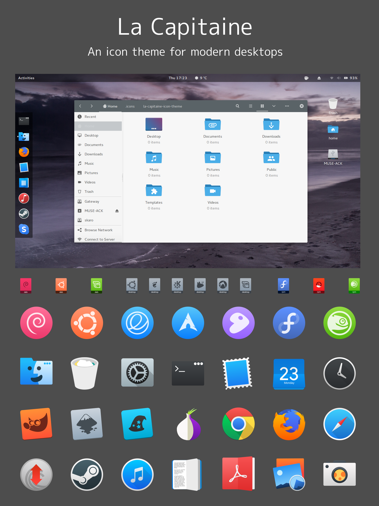

### What is this?
La Capitaine is an icon pack, designed to integrate with most desktop environments. The set of icons takes inspiration from the latest iterations of macOS and Google's Material Design through the use of visually pleasing gradients, shadowing, and simple icon geometry.

Every image in this theme is a _scalable vector graphic_ so it will look great at any size, on any screen. In my spare time, I work on adding new icons, updating old ones, and making this theme more complete. Since this theme is updated often, you should clone this git repository and pull regularly to make sure you're always up-to-date:
```
cd ~/.icons
git clone https://github.com/keeferrourke/la-capitaine-icon-theme.git
```
Alternatively, there is an [AUR PKGBUILD](https://aur.archlinux.org/packages/la-capitaine-icon-theme-git) available, so if you're on Arch Linux, simply run:
```
yaourt -S la-capitaine-icon-theme-git
```
and keep yourself on the _bleeding edge_ of this repo :smile:

### Configuration
La Capitaine comes with a configuration script which attempts to determine your distribution and desktop environment. Using this information, La Capitaine updates several system icons and icons used for mime-types.

For best integration with your distro/desktop environment, please run `./configure` and follow the prompts.

#### Use a dark GTK+ theme?
La Capitaine doesn't ship with two distinct variants, because I wanted to keep the size of this project to a minimum.

You'll need to run the configuration script to tell La Capitaine to update its directory structure to use the dark variant.

### License
La Capitaine is a fork of the El General icon theme for the GNOME desktop with significant changes.
El General is in turn a fork of the Numix-circle icon theme.
As such, La Capitaine is a derivative work mostly licensed under the GPLv3.

The configuration script included here is written by me and licensed under the permissive MIT license.

See the `LICENSE` and `COPYING` files for more details.

### Donations
I'm a poor university computer science student, and I spend many hours per week working on this and other projects &mdash; If you like this icon pack and want to support me, please consider donating via [Paypal](https://paypal.me/keeferrourke), [Patreon](https://www.patreon.com/krourke), or [Bitcoin](https://krourke.org/btc.html) :smile:

If you want to contribute to this project but can't make a monetary donation, shoot me an email and we can sort something out.

Be sure to check out `Thanks.md` to see a list of significant donors and contributors!

### Icon Requests
If there's an icon that's missing in this project, feel free to [contact me](https://krourke.org/contact) or _open an issue_.

Please follow this format for requests:
```
Application: <name of application>
Icon name: <name of icon>
Context: <e.g. app, status, action, etc. (if known)>
Icon reference:
<attach image of original icon>
```
You should take a look at [request #58](https://github.com/keeferrourke/la-capitaine-icon-theme/issues/58) for a real example of the format I'm looking for. Following the requested format makes my life easier and guarantees that your request will be fulfilled faster :grin:

If your request is for a desktop application (it usually is), you can find the icon name in the application's `*.desktop` file located at `/usr/share/applications/yourapplication.desktop` or `$HOME/.local/share/applications/yourapplication.desktop`.

If you find that an application icon is not themed, but an icon appears in this project with the wrong (or a different) file name as specified in your x-desktop file, please let me know and _open an issue_.

### Roadmap
To-do:
 * Add alternative file-browser icons (requested a few times)
 * Clean up directories, de-duplicate and remove redundant icons
 * Add design guidelines and documentation to the wiki

### Recommendations
La Capitaine looks best with a theme based on either Material Design or macOS. Though I don't make GTK+ themes, some of my favourites are: [Flat-Plat](http://gnome-look.org/content/show.php/Flat-Plat?content=167704), [Adapta](https://github.com/tista500/Adapta), [Paper](https://snwh.org/paper/theme), [Arc](https://github.com/horst3180/arc-theme), and [Arc-OSX](http://gnome-look.org/content/show.php/Arc-OSX-themes?content=175536). Have fun, and happy theming!

### Preview

<!--  -->

